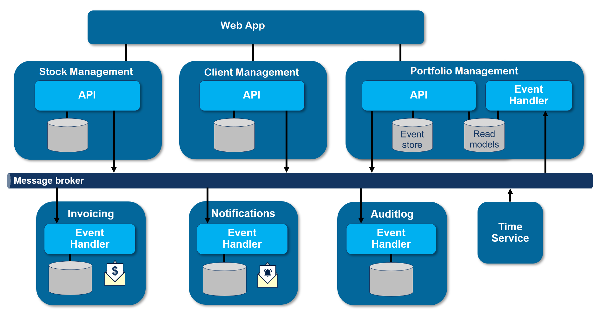

# StockDesk - High-frequency Trading management system
StockDesk is a high-frequency trading application designed for traders who seek rapid and efficient execution of trades in the stock market. The primary goal of this sample is to demonstrate several software-architecture concepts like:  

* Microservices / Domain-Driven Design (DDD) / Event driven Architecture / Event sourcing  
* CQRS  
* Built using .net core and asp.net core
* RabbitMQ as message broker
* SQL server
* Eventual Consistency 

and how to use container-technologies like:

* Docker
* Linux docker containers

# Solution Architecture

I've created a solution architecture diagram showcasing all components of the application and their relationships. You'll likely recognize how the services in this architecture correspond to the bounded contexts in the context map.

# StockDesk Web App

The web application serves as the front-end interface for the stock trading system. Through this interface, users can manage client portfolios, handle stocks, and plan investment strategies efficiently. The front-end solely interacts with APIs within the system and remains unaware of backend intricacies such as the message broker or other internal services.

# Client Management Service

This service provides an API tailored for client management within the system. Currently, it supports CREATE and READ operations, including listing clients and retrieving individual client data by unique ID.

Command handled:

* RegisterClient

Events published:

* ClientRegistered

# Stock Management Service

This service provides an API for managing stocks within the system. Currently, it supports CREATE and READ operations, allowing listing of stocks and retrieval of individual stock data by unique ID.

Commands handled:

* RegisterStock

Events published:

* StockRegistered

# Notification Service

The notification service dispatches notifications to all client scheduled for trading tasks on the current day. It exclusively processes events from the message broker and does not provide an API.

Events handled:

* ClientRegistered
* DayHasPassed
* TradingPlanned
* TradingFinished

# Invoice Service

The invoice service generates invoices for completed trading jobs that haven't been invoiced yet. It exclusively processes events from the message broker and does not provide an API. Invoices are created as HTML email messages and sent to client.

Events handled:

* ClientRegistered
* DayHasPassed
* TradingPlanned
* TradingFinished

# Time Service

The Time service notifies other services when a specific time period has elapsed. Currently, it only supports the DayHasPassed event.

This approach simplifies testing of time-dependent functionality by removing the need to manipulate the system clock on test machines. Instead of relying on system time for timeouts, services respond to events.

Events published:

* DayHasPassed

# Audit Log Service

The AuditLog service captures all events from the message broker and stores them for future reference. It exclusively processes events from the message broker and does not provide an API.

# Portfolio Management Service

This service comprises two components: an API for managing stock trading job planning and an event handler responsible for processing events and constructing a read model used by the API.

> API:

The API manages stock trading jobs within the system. To ensure continuous functionality of Portfolio Management, even in the event of other service failures, the API provides functionality to retrieve stock and client information from the read model. This read model is populated by the event handler described below.

Commands handled:

* PlanTrading
* FinishTrading

Events published:

* PortfolioPlanningCreated
* TradingFinished
* TradingPlanned

Within this bounded context, I've employed a Domain-Driven Design (DDD) approach. The Portfolio Planning aggregate manages all commands and generates events, which are subsequently published using the message broker.

Utilizing event sourcing for persisting its state, every incoming command is initially converted into an event and processed by the aggregate, altering its internal state. The state is persisted by storing a list of all events that occurred for one aggregate instance. When another command is received for an aggregate instance (identified by its unique ID), all events are replayed and handled by the aggregate to restore its previous state. The aggregate provides a specific constructor that accepts a list of events and replays them internally.

# Portfolio Management Event Handler

The event handler consumes events containing details about clients and stocks from the message broker. It exclusively processes events from the message broker and does not provide an API. As previously mentioned, it constructs a read model utilized by the front-end for scheduling stock trading jobs. This guarantees the ability to schedule new jobs and manage existing ones even if the Client Service or Stock Service is unavailable.

Events handled:

* ClientRegistered
* StockRegistered
* TradingPlanned
* TradingFinished